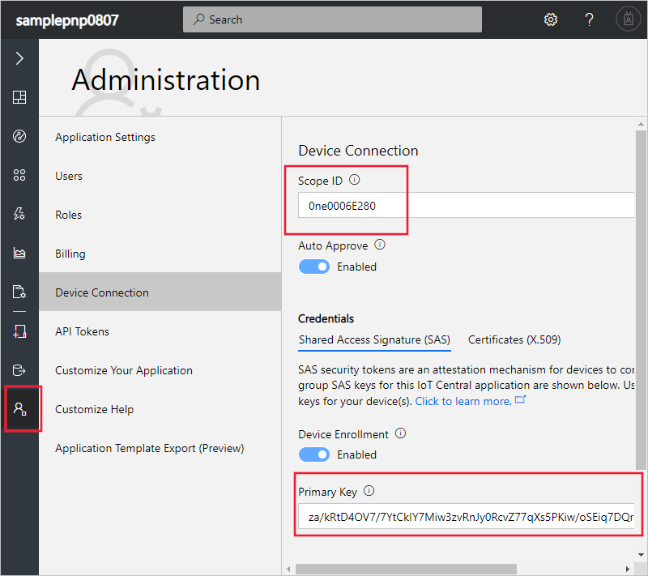

# Introduction


This project contains a set of IoT PnP applications ([nvidia-jetson-dcs](https://github.com/toolboc/azure-iot-nvidia-jetson-deepstream-pnp/tree/master/nvidia-jetson/nvidia-jetson-dcs) & [nvidia-jetson-dps](https://github.com/toolboc/azure-iot-nvidia-jetson-deepstream-pnp/tree/master/nvidia-jetson/nvidia-jetson-dps)) to enable remote interaction and telemetry for [DeepStream](https://developer.nvidia.com/deepstream-sdk) on [Nvidia Jetson Devices](https://www.nvidia.com/en-us/autonomous-machines/embedded-systems/) primarily for use with [Azure IoT Central](https://docs.microsoft.com/en-us/azure/iot-central/?WT.mc_id=github-deepstreampnp-pdecarlo).  

The nvidia-jetson-dcs application accomplishes this using a [device connection string]((https://docs.microsoft.com/en-us/azure/iot-central/quick-create-pnp-device-pnp?toc=/azure/iot-central-pnp/toc.json&bc=/azure/iot-central-pnp/breadcrumb/toc.json?WT.mc_id=github-deepstreampnp-pdecarlo#generate-device-key)) for connecting to an [Azure IoT Hub](https://docs.microsoft.com/en-us/azure/iot-hub/tutorial-connectivity#create-an-iot-hub?WT.mc_id=github-deepstreampnp-pdecarlo) instance, while the nvidia-jetson-dps application leverages the Azure IoT [Device Provisioning Service](https://docs.microsoft.com/en-us/azure/iot-dps/?WT.mc_id=github-deepstreampnp-pdecarlo) within [IoT Central](https://docs.microsoft.com/en-us/azure/iot-central/?WT.mc_id=github-deepstreampnp-pdecarlo) to create a self-provisioning device. 

The content in this README will focus primarily on the nvidia-jetson-dps application to demonstrate how to create a self-provisioning Azure IoT PnP app for your Jetson Nano device that can remotely kickoff deepstream processing using a custom configuration present on the host device, allowing you to create a cloud configurable Intelligent Video Application with device monitoring and live telemetry in [IoT Central](https://docs.microsoft.com/en-us/azure/iot-central/?WT.mc_id=github-deepstreampnp-pdecarlo).

With this design, you can easily customize a deepstream configuration to leverage a custom inferencing model to perform object detections on any available deepstream input sources including: camera sources (USB & CSI), RTSP Streams, and local h.264/5 video files 

## Building the PnP applications

Compiling this project requires building against the current `public-preview` of the azure-iot-sdk-c.  While it is possible to cross-compile this codebase from an AMD64 machine, we  will take advantage of the ARM64 environment present in the Nvidia JetPack OS images to build the included applications.  This will require that you have an Nvidia Jetson device configured with the [latest JetPack offering from Nvidia](https://developer.nvidia.com/embedded/jetpack) and an ability to interact it with the device via ssh or a connected keyboard/mouse/monitor.

All steps below must be performed on the Nvidia Jetson device:

1. Begin by installing the dependencies needed for compilation of the azure-iot-sdk-c 
    ```bash
    sudo apt-get update
    sudo apt-get install -y git cmake build-essential curl libcurl4-openssl-dev libssl-dev uuid-dev pkg-config
    ```
    We will also need to install node.js and the dps-keygen tool for use in generate a DPS Symmetric Key

    ```bash
    curl -sL https://deb.nodesource.com/setup_10.x | sudo -E bash -
    sudo apt-get install -y nodejs
    sudo npm i -g dps-keygen
    ```

1. Verify that **CMake** is at least version **2.8.12** and **gcc** is at least version **4.4.7**.
    ```bash
    cmake --version
    gcc --version
    ```

1. Clone the preview release of the SDK to your home directory using the `public-preview` branch
    ```bash
    cd ~
    git clone https://github.com/Azure/azure-iot-sdk-c --recursive -b public-preview
    ```
    > The `--recursive` argument instructs git to clone other GitHub repos this SDK depends on. Dependencies are listed [here](https://github.com/Azure/azure-iot-sdk-c/blob/master/.gitmodules).

1. Navigate into the newly created folder containing the contents of the azure-iot-sdk-c and copy this repo inside of it with:
    ```bash
    cd ~/azure-iot-sdk-c
    git clone https://github.com/toolboc/azure-iot-nvidia-jetson-deepstream-pnp.git
    ```

1. Create IoT Central Application and obtain the DPS connection parameters:
    * Complete the [Create an Azure IoT Central application (preview features)](https://docs.microsoft.com/en-us/azure/iot-central/quick-deploy-iot-central-pnp?toc=/azure/iot-central-pnp/toc.json&bc=/azure/iot-central-pnp/breadcrumb/toc.json?WT.mc_id=github-deepstreampnp-pdecarlo) quickstart to create an IoT Central application using the Preview application template.

    * Retrieve the DPS connection infomation from Azure IoT Central, including [DPS ID Scope], [DPS Symmetric Key], and [device ID].  These will be passed as parameters to the nvidia-jetson-dps application executable. To obtain these, follow the [steps to Generate a device key](https://docs.microsoft.com/en-us/azure/iot-central/quick-create-pnp-device-pnp?toc=/azure/iot-central-pnp/toc.json&bc=/azure/iot-central-pnp/breadcrumb/toc.json#generate-device-key?WT.mc_id=github-deepstreampnp-pdecarlo) or follow the steps below.

    [DPS ID Scope] is obtained from the "Administration => Device Connection" section of your IoT Central Application.  

    

    Once you have obtained the Primary Key, execute the following: 

    (Note: the value for -di can be any name of your choosing and will become the name registed to IoT Central when the application is first run)

    ```
    dps-keygen  -di:jetson-device -mk:{Primary Key from IoT Central}
    ```

    The value used for -di becomes [device ID] and the output of executing the above command becomes [DPS symmetric key] (i.e. **not** the value of the Primary Key)

1. Open the `CMakeLists.txt` in the **azure-iot-sdk-c** folder and modify it to include the **nvidia-jetson** folder so that the pnp applcations will be built together with the Device SDK. To do this, add the line below to the end of the file.
    ```txt
    add_subdirectory(azure-iot-nvidia-jetson-deepstream-pnp/nvidia-jetson-dcs)
    add_subdirectory(azure-iot-nvidia-jetson-deepstream-pnp/nvidia-jetson-dps)
    ```

1. In the same **azure-iot-sdk-c** folder, create a folder to contain the compiled app.
    ```bash
    mkdir cmake
    cd cmake
    ```

1. In the **cmake** folder you just created, run CMake to build the entire folder of Device SDK including the generated app code.
    ```bash
    cmake .. -Duse_prov_client=ON -Dhsm_type_symm_key:BOOL=ON -Dskip_samples:BOOL=ON
    cmake --build . --config Release
    ```

1. Once the build has succeeded, you can test it by invoking either of the following commands.

    * To pass the DPS info as command line parameters.  For most purposes, this will be the command that you want to test
        ```bash
        ~/azure-iot-sdk-c/cmake/azure-iot-nvidia-jetson-deepstream-pnp/nvidia-jetson-dps/nvidia-jetson-dps [DPS ID Scope] [DPS symmetric key] [device ID]
        ```

    * You may also choose to read your DPS connection info from a security store using the related functions in ~/azure-iot-sdk-c/nvidia-jetson/nvidia-jetson-dps/**main.c**.
        ```bash
        ~/azure-iot-sdk-c/cmake/azure-iot-nvidia-jetson-deepstream-pnp/nvidia-jetson-dps/nvidia-jetson-dps
        ```
    
    * Optionally, to test the device connection string version of the application, ensure that you have followed the [steps to create an Azure IoT Hub](https://docs.microsoft.com/en-us/azure/iot-hub/tutorial-connectivity#create-an-iot-hub?WT.mc_id=github-deepstreampnp-pdecarlo) then follow the [steps to create the device connection string](https://docs.microsoft.com/en-us/azure/iot-central/quick-create-pnp-device-pnp?toc=/azure/iot-central-pnp/toc.json&bc=/azure/iot-central-pnp/breadcrumb/toc.json?WT.mc_id=github-deepstreampnp-pdecarlo#generate-device-key)
        ```bash
        ~/azure-iot-sdk-c/cmake/azure-iot-nvidia-jetson-deepstream-pnp/nvidia-jetson-dcs/nvidia-jetson-dcs "[IoTHub device connection string]"
        ```


